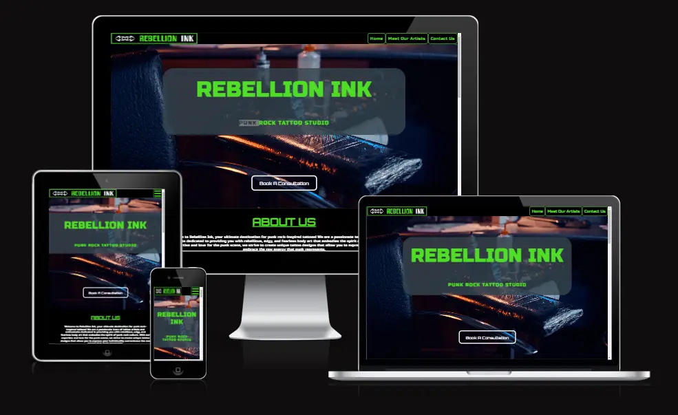
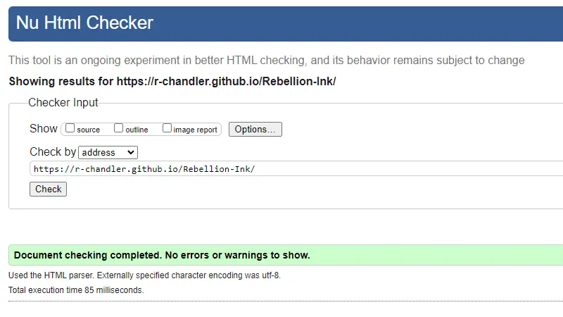
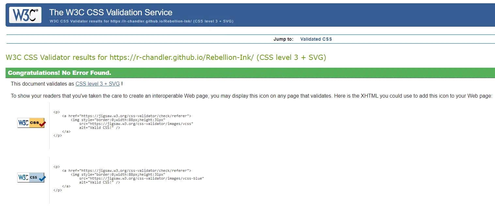

# Rebellion Ink

Rebellion Ink is a tattoo studio website with a punk aesthetic.  The site has information regarding the current studio artists, including a gallery of their previous work. Finally you will be able to begin the process of booking your tattoo with the studio using the consultation form located on the contact page.

## User stories

#### First Time Visitor Goals
 - As a First Time Visitor, I want to easily find artist
   portfolios/previous work to see if it is what i am looking for in a
   tattoo.
 - As a First Time Visitor, I want to see reviews that would inform my  
   decision on wether to use this tattoo studio.
 - As a First Time visitor, I want to be able to easily navigate
   throughout the site to     find what i am looking for.

#### Returning Visitor Goals
 - As a Returning Visitor, I want to easily find a way to book a
   consultation.
 - As a Returning Visitor, I want to find the best way to get in contact
   with the organization with any questions I may have.
 - As a Returning Visitor, i may want to access aftercare information for a tattoo they recently had.
 - As a Returning User, I would like to find social media links to follow the tattoo studio for information on new designs, promotions and events.

## Design
### Colour Scheme
- A dark background has been used to help accentuate the acid green used across the site. Al over text is in white to also stand out against the dark background.
### Typography
- 'Russo One' was used as the primary font across the website due to its blocky form which assists with readability and matches the desired punk style of the website.
### Images
- I chose particulary colourful images for the gallery section to bring attention to the images and highlight the work that the artists have carried out.

## Wireframes

#### Home Page
-   Home Page Wireframe 1- [View](readme_media/wireframes/Landing_Page.png)
-   Home Page Wireframe 2 - [View](readme_media/wireframes/Home_Page_2.png)
-   Home Page Wireframe 3 - [View](readme_media/wireframes/Home_Page_3.png)
-   Home Page Wireframe 4 - [View](readme_media/wireframes/Home_Page_4.png)
#### Meet The Artists/ Gallery
- Meet The Artists/ Gallery Wireframe 1 - [View](readme_media/wireframes/Meet_The_Artists_Page.png)
- Meet The Artists/ Gallery Wireframe 2 - [View](readme_media/wireframes/Meet_The_Artists_Page_2.png)
- Meet The Artists/ Gallery Wireframe 3 - [View](readme_media/wireframes/Meet_The_Artists_Page_3.png)
#### Contact Us
-   Contact Us Page Wireframe 1 -  [View](readme_media/wireframes/Contact_Us_Page.png)
-  Contact Us Page Wireframe 2 -  [View](readme_media/wireframes/Contact_Us_Page_2.png)
#### Mobile View
-  Mobile Wireframe -  [View](readme_media/wireframes/Mobile_View.png)

## Features
- Responsive on all device sizes
- Responsive navigation element which changes to a drop down menu on smaller view widths.
- An interactive carousel element on the review section to scroll through reviews on smaller view widths.
### Future Features
- Individual artist pages to further define the individual artists and show their work independently.
- To add the ability to post reviews directly to the site.
- Change the current CSS carousel to a JavaScript carousel.

## Technologies Used
- HTML5
- CSS3
- GitHub
- Code Anywhere
- Font Awesome
## Testing
### HTML Validation

### CSS Validation

### Live Testing
I carried out life testing after the website had been deployed to GitHub pages using the following devices & browsers;
- Desktop computer
	- Using Google Chrome
- IPhone XR
	- Safari
	- Google Chrome
	
I also asked 2 of my friends to take a look and see I they could see any issues using their devices and browsers. Between them they also tested on the following additional platforms;
- Desktop computer
	- Opera
- Apple IPad
	- Safari
### Known Bugs
1. When being viewed on and Apple via Safari, the hamburger drop down menu only operates using a force touch rather than just a tap. With more knowledge in the future i would come back and fix this issue using JavaScript. 
2. Also while using Safari on a mobile device the contact phone number located on the contact page becomes a clickable link. This is not represented in the code and I believe this is a Safari function when presented with a phone number.
3. While using Google Chrome on a mobile device the contact email address located on the contact page becomes a clickable link. This is not represented in the code and I believe this is a Chrome function when presented with an email address.
## Deployment

### GitHub Pages

The website has been deployed to GitHub pages and can be located using the following link.

[https://r-chandler.github.io/Rebellion-Ink/](https://r-chandler.github.io/Rebellion-Ink/)

## Credits
### Picture Credits
- Chair arm and tools - <a  href="https://www.freepik.com/free-photo/dark-photo-different-equipment-tattoo-making-tattoo-salon_26605680.htm#query=tattoo%20parlor&position=1&from_view=search&track=ais">Image by fxquadro</a> on Freepik
- Male tattoo artist - Photo by Pavel Danilyuk: https://www.pexels.com/photo/a-man-in-white-shirt-holding-a-tattoo-machine-6593424/
- Female tattoo artist - Photo by Antoni Shkraba: https://www.pexels.com/photo/a-female-tattoo-artist-sitting-in-a-tattoo-parlor-7005726/
- Info Box Background  - Photo by Skylar Kang: https://www.pexels.com/photo/dark-background-with-pale-wavy-lines-6044820/

  

### Gallery Photo Credits

  

- Photo by <a  href="https://unsplash.com/@thomexinxan?utm_source=unsplash&utm_medium=referral&utm_content=creditCopyText">Hung Pham</a> on <a  href="https://unsplash.com/images/things/tattoo?utm_source=unsplash&utm_medium=referral&utm_content=creditCopyText">Unsplash</a>
- Photo by <a  href="https://unsplash.com/@dnunis?utm_source=unsplash&utm_medium=referral&utm_content=creditCopyText">Darren Nunis</a> on <a  href="https://unsplash.com/images/things/tattoo?utm_source=unsplash&utm_medium=referral&utm_content=creditCopyText">Unsplash</a>
- Photo by <a  href="https://unsplash.com/@matheusfrade?utm_source=unsplash&utm_medium=referral&utm_content=creditCopyText">Matheus Frade</a> on <a  href="https://unsplash.com/images/things/tattoo?utm_source=unsplash&utm_medium=referral&utm_content=creditCopyText">Unsplash</a>
- Photo by <a  href="https://unsplash.com/@sierragracephotography96?utm_source=unsplash&utm_medium=referral&utm_content=creditCopyText">Sierra Koder</a> on <a  href="https://unsplash.com/photos/bBtGi7Y6Aco?utm_source=unsplash&utm_medium=referral&utm_content=creditCopyText">Unsplash</a>
- Photo by <a  href="https://unsplash.com/fr/@ericvieira?utm_source=unsplash&utm_medium=referral&utm_content=creditCopyText">Eric Vieira</a> on <a  href="https://unsplash.com/images/things/tattoo?utm_source=unsplash&utm_medium=referral&utm_content=creditCopyText">Unsplash</a>
- Photo by <a  href="https://unsplash.com/@yurii_stupen?utm_source=unsplash&utm_medium=referral&utm_content=creditCopyText">Yurii Stupen</a> on <a  href="https://unsplash.com/images/things/tattoo?utm_source=unsplash&utm_medium=referral&utm_content=creditCopyText">Unsplash</a>
- Photo by <a  href="https://unsplash.com/@morsha?utm_source=unsplash&utm_medium=referral&utm_content=creditCopyText">Mor Shani</a> on <a  href="https://unsplash.com/images/things/tattoo?utm_source=unsplash&utm_medium=referral&utm_content=creditCopyText">Unsplash</a>
- Photo by <a  href="https://unsplash.com/ko/@chriskristiansen?utm_source=unsplash&utm_medium=referral&utm_content=creditCopyText">Chris Blonk</a> on <a  href="https://unsplash.com/images/things/tattoo?utm_source=unsplash&utm_medium=referral&utm_content=creditCopyText">Unsplash</a>
- Photo by <a  href="https://unsplash.com/@omar_hinojosa?utm_source=unsplash&utm_medium=referral&utm_content=creditCopyText">Omar Hinojosa</a> on <a  href="https://unsplash.com/photos/AjC2x6hrCr4?utm_source=unsplash&utm_medium=referral&utm_content=creditCopyText">Unsplash</a>
- Photo by <a  href="https://unsplash.com/@felpsskater?utm_source=unsplash&utm_medium=referral&utm_content=creditCopyText">Felipe Vieira</a> on <a  href="https://unsplash.com/photos/FCC2jFSnkDc?utm_source=unsplash&utm_medium=referral&utm_content=creditCopyText">Unsplash</a>
- Photo by <a  href="https://unsplash.com/@anniespratt?utm_source=unsplash&utm_medium=referral&utm_content=creditCopyText">Annie Spratt</a> on <a  href="https://unsplash.com/photos/aJOibhKp1pA?utm_source=unsplash&utm_medium=referral&utm_content=creditCopyText">Unsplash</a>
- Photo by <a  href="https://unsplash.com/@luismisanchez?utm_source=unsplash&utm_medium=referral&utm_content=creditCopyText">Luismi Sánchez</a> on <a  href="https://unsplash.com/photos/f4n24BEfH7k?utm_source=unsplash&utm_medium=referral&utm_content=creditCopyText">Unsplash</a>
### Code Credits

Creating the carousel on the index page would not have been possible without the use of online tutorials and code libraries.

The code itself was modified to fit my needs but the original code was found on codepen.io - written by Andrew Chaika (andrewchaika).
